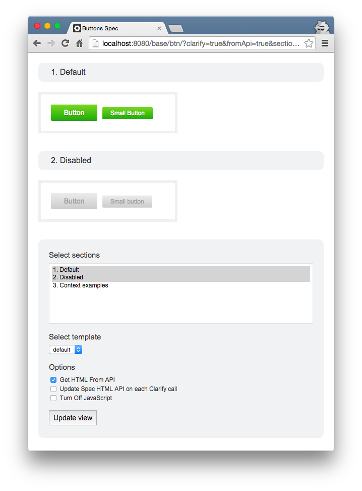

SourceJS middleware, that allows to open separate documentation examples in custom or clean environment for component testing and development.

## General information

Clarify is an [expressJS](http://expressjs.com/) middleware built into SourceJS engine. Easy configurable through URL parameters in Spec pages:

```html
http://localhost:8080/docs/spec-html/?clarify=true&sections=1.1
```

When enabled, Clarify uses [Cheerio](https://github.com/cheeriojs/cheerio) for getting specified sections and wrap them in pre-defined or user templates. If you're using SourceJS HTML API, Clarify can be configured to take data directly from API storage as well.

Clarify page is enhanced with helper panel, where you can chose any option available:

[](/docs/spec-html/?clarify=true&sections=1.1)

## List of parameters

| Param | Value | Default setting | Description |
|---|---|---|
| clarify | Boolean | false | Turn on clarify middleware. |
| sections | 1, 1.1, 3 | empty | List of sections to show. If empty, lists all high level section examples. |
| fromApi | Boolean | false | Set to `true`, if want to get rendered HTML from API in response. |
| apiUpdate | Boolean | false | Set to `true`, if want to run HTML API update on spec, before getting results. Used only in combination with `fromApi` |
| nojs | Boolean | false | Turn on and off JS injection from the Spec. |
| tpl | template-name | default | Define EJS template name to render sections. Templates are defined in `core/views/clarify/` and `user/core/views/clarify/`, user templates overrides core. |

To play around with available URL params, open [Clarify page](/docs/spec-html/?clarify=true&sections=1.1) and fill the helpers form below.

## Use cases

Clarify is covering wide range of use cases:

* Testing in old desktop browsers, which are not supported in SourceJS Specs
* Testing on mobile, for faster Spec page loading
* Focusing on single example during development
* Isoleted page for automated testing
* Responsive design testing
* Fast transfer of code examples to templates
